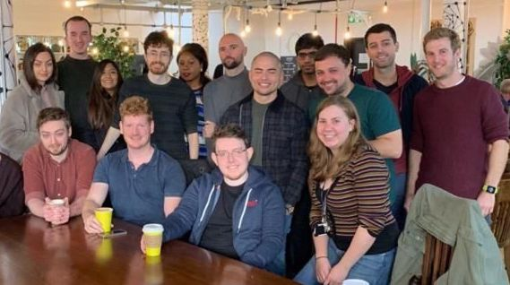
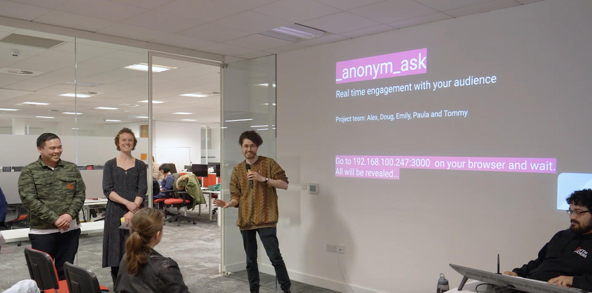

# My Experience Teaching

## My journey into coding

Whenever anyone asks me what brought me into coding I tell this same story:

I wasn't a good student in secondary school. I was quiet, anxious and couldn't figure out what my calling was.

I had always been interested in computers at a young age. Pressing buttons, inputting commands and seeing an exciting explosion of activity that for all I knew was pure magic. Almost every device i've owned has been tinkered with and/or had Linux installed onto it.

I remember installing the Emerald Window Decorator onto a super budget netbook and having my windows wobble around the screen like jelly when dragged and exploding into flames when closed.

I remember booting linux on my sisters nintendo DS, navigating the filesystem briefly before uninstalling it and moving on to other homebrew applications.

I remember installing a media player onto my softmodded wii and playing Green Day through the tiny TV I had in my bedroom. I had an iPod, I had CDs - but the music wasn't the point, it was the excitement of **making it work**

The obvious route for a child like me was _"something in computers"_.

But I was terrible at Maths and Science and only absolute top-of-the-class geniuses can do computers, right? Even if I overcame my self-doubt the barrier to entry for Universities was too high.

So I pursued another passion of mine - helping and caring for people - and studied Nursing at Brighton University. Long story short I graduated but after 4 years in Uni I struggled with stress and some health issues which forced me to quit.

Back to square one I took up various new jobs: Retail, Baker, Kitchen Porter/Assistant, Events Organiser, Community Care Worker, Bar Manager

Eventually, in my late 20s, I moved up from Brighton to Cheltenham to live with my girlfriend at the time. In Cheltenham, between community care and bar shifts, I started to play with learn-to-code apps and made very basic console apps in Python that printed messages.

There was that spark again, I was **making it work**

She got a job in Manchester and we moved up. I got a job at a bar but longed to pursue this rediscovered world of code.

Inspired, I applied for a Foundation Degree in Software Engineering at Manchester Metropolitan University and just _barely_ managed to convince them to let me on with my mediocre Maths and Science GCSEs.

I was going to take on a 4 year course and take on **£9,000/year **tuition fee debt as well as living expenses but how else do you learn to code? My tutorial apps can only get me so far and, like many my age, I was conditioned to believe University was the only way to get good jobs.

Week one was terrible. No code and only one session using computers. We hit the ground crawling. _"It'll pick up, it'll get better"_ is what I thought and I would have stuck with it if it weren't for "Maths 101". In this session the lecturer gave us an exam to cover some Maths "basics" that we should already know. I didn't recognise some of the symbols.

This is one of the really important parts of the story right here. My preconceptions about who can code were being proven right. Coding is just for Maths and Science geniuses. The door was closed to people like me.

I left the course and thankfully didn't have to pay a penny.

It was at this point that I learnt about Northcoders.

For **£6,000** they promised a pathway into the coding industry. No university needed, only basic Maths and English skills required. 12 weeks.

The first email I got from them read:

> Hello Douglas!

> Northcoders is the Coding Bootcamp for the North. If you're interested in code and have been thinking about choosing it as a career, come and join us - and more people like you - on a fun and challenging course that we make sure will get you an exciting career in tech.

> We won't stop setting up interviews for you until you find a job in software development. We're confident we will, too, because our hiring partners know our curriculum is what the industry needs.

Ever heard the phrase "if it sounds too good to be true it probably is"? That's what I was thinking. It's a better deal than university but I'm nervous about spending money on new shoes let alone something as risky as this.

_And what if I wasn't smart enough? What if I didn't get a job after? What if? What if?_

By chance, I had a contact from my events organising days, I knew someone who knew someone who did the course and they confirmed it was legit. Not a scam and helped them get their first job.

After some long conversations with my girlfriend and my mum I signed up for a campus tour and took the entry challenge. I was nervous but passed all the tests within 15 mins of the hour they give you. I joined the cohort in October 2019.

## Doug the student

Northcoders, as advertised, is a very intensive bootcamp. I absolutely loved it.

We were coding from day 1 and were constantly piling on new concepts. At 5 o'clock I felt like my brain had run a marathon, my body had to rest - I rarely had time to do anything but eat, sleep, code. We were building things constantly.

The tutors. Oh my god. They were so passionate and engaging and _**cool**_. Each tutor had been through the Northcoders bootcamp and had similar stories to mine and my fellow students.

Everyone was there to learn. Everyone had different stories to tell but most read a lot like what you've read about mine so far.

My mindset as a student was very much driven by the amount of money that I had paid to get onto the course and my **need** to get the most out of the course so I can get a job afterwards. I had to prove to myself that I could do it.

I wasn't satisfied with "code this to do that". I wanted to know _why_, _how does that work_, _should it **always** be done this way_, _what if I do... this_?

Anxiety and embarrassment be damned - if I didn't understand something I was going to ask as many questions as i needed to until I did.

At Northcoders students follow an "agile inspired" curriculum and are given a "sprint" to tackle and use the skills we'd picked up that day. Often this would be a paired sprint that lasted one or two days. I enjoyed pairing and, while I love solving things by myself, there was a strange new enjoyment I was getting out of explaining my ideas to my pairing partner and allowing concepts to be cemented by talking through it verbally.

Looking back this is probably the first clue I got that I would enjoy teaching as well as what tipped Northcoders to hire me - more on that later.

While on the course I was trying to get a sense of what I was good at. Similar to my childhood self - what was my calling? I love the idea of Front end development, UI and UX fascinate me. I love the idea of Back end development, database transactions, data flow. So maybe Full stack?

It was day 5 of week 12, project phase presentations were in a few hours. Alex and I were sitting in the corner office applying some hotfixes to our app and practising our lines for the presentation. I was pulled away by a tutor into a side room where I was offered a job as a tutor at Northcoders. It was completely unexpected (i didn't even know they were hiring) but I answered yes before leaving that room.

I hadn't ever thought of myself being a tutor. I didn't have any formal teaching qualifications or experience but they assured me they'd provide all the training and support i'd need.

I did the presentation with the weight of the job hunt off my shoulders. I had completed the Northcoders bootcamp.

## Doug the tutor

I love teaching.

The most satisfying part of my job as a Tutor at Northcoders is to be helping students with problems later on in the course. I enter a zoom call with them and they start explaining their issue to me as well as what they've tried so far.

> _"We're having an issue trying to update state in this component, we've got state stored here, we're passing down props here, we're making an api call here... let's show you the axios request... we've put a console.log here which we're seeing and it get's back into the .then block but when we log it out after it's not updating! Our guess is that it has something to do with [etc etc...]"_

Their tone is a mixture of confusion, curiosity a hint of frustration and all wrapped up in an intense focus on their code and the logic they're using.

I eat this up. To listen to students rattle off all this technical terminology so casually and to feel the determination to solve it and learn from it warms my heart. I love to help and I love to make a learning experience out of it. Because I am like them and we share that drive for the feeling you get when you **make it work.**
