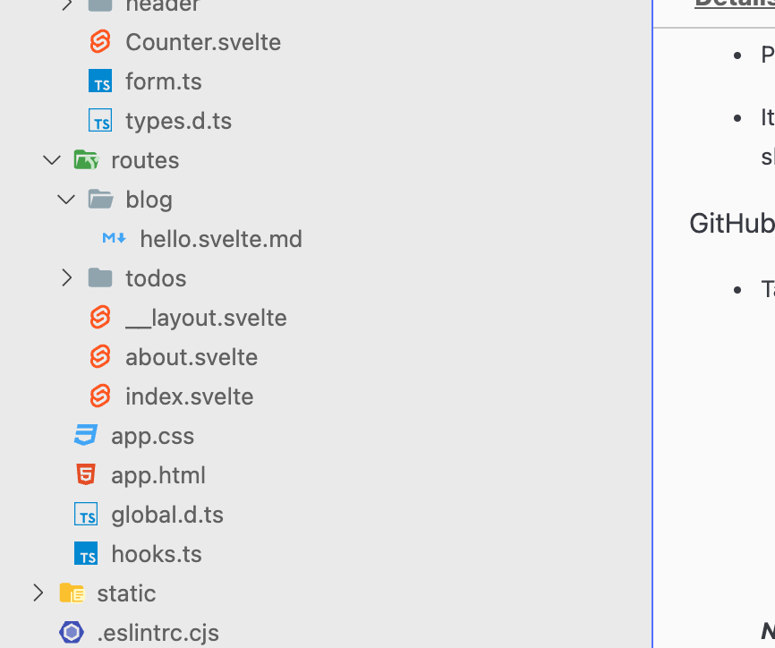

<script lang="ts">
import Counter from '$lib/Counter.svelte'
</script>

# title

lorem

<Counter/>



```js
const config = {
	extensions: ['.svelte.md', '.md', '.svx'],

	smartypants: {
		dashes: 'oldschool'
	},

	remarkPlugins: [],
	rehypePlugins: []
};

export default config;
```
